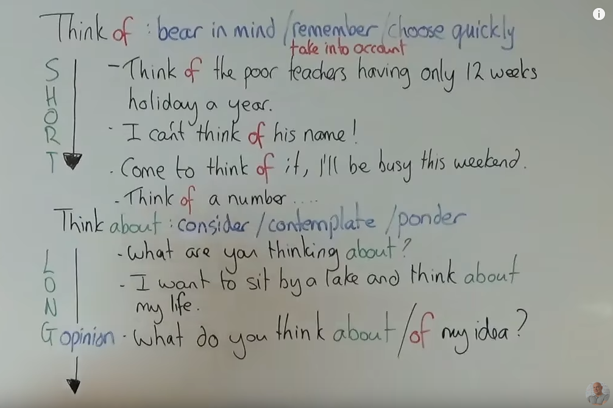

# think about和think of的区别

## 01 - 中国式英语解读

> 资料来源： [有道课堂之杨亮英语特训班]think about和think of有什么区别

### (a) think about
* `about`是`on by out`三个单词的简称，表示`“在旁边，在外面”`。
* `about`之所以有`大约的`意思，是因为`就是不精准`，在周围，在旁边，在外围。
* `think about`的意思，指的是`想一件事情周边的详细情况`或者
  `想与某一个人有关的事儿`。

### (b) think of

* `of`是`blong to`，即`......的`。例如：a friend `of` mine, 我的一个朋友。
* `of`指的是与这个人或这件事本身相关的情况。

```
I'm thinking about you. 我在想和你有关的事儿。# 不是在想你这个人
I'm thinking of    you. 我在想你这个人。      # 不是在想和你有关的事儿
```

## 02 - 地道英文解读



> 资料来源：[Think of and Think about / Practice English with Paul][0201]

[0201]: https://www.youtube.com/watch?reload=9&v=5aWcK-Ofh18

```
Think of: bear in mind | remember | take into account | choose quickly
 S|     - Think of the poor teachers having only 12 weeks holiday a year.
 H|     - I can't think of his name.
 O|     - Come to think of it, I'll be busy this weekend.
 R|     - Think of number ...
 T|
Think about: consider | contemplate | ponder
 L|     - What are you thinking about?
 O|
 N|     - I want to sit by a lake and think about my life.
 G|
opinion - What do you think about/of my idea?
  |
```

## 03 - 补充说明

N/A
